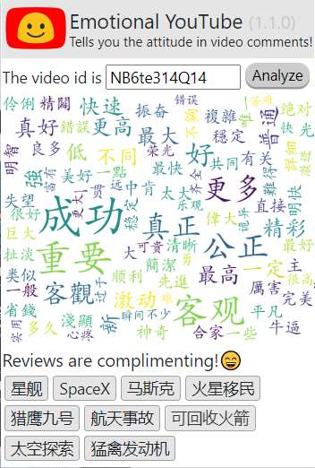

Emotional YouTube is a browser extension that provides information and analysis for YouTube videos.
## **Cloud Environment Setup**
Please visit and read the documentation from Google to set up a GCP account and a project.

[Google Cloud Platform Setup Guide](https://cloud.google.com/deployment-manager/docs/step-by-step-guide/installation-and-setup)

Enable `Google Natural Language API` and `YouTube Data V3 API`. Acquire API key and application credential, and setup environmental variables:
```{sh}
GOOGLE_APPLICATION_CREDENTIALS = your_credentials
APIKEY = your_apikey
```

## **Environment Setup**
Clone from Github and install all the dependencies:
```{sh}
git clone https://github.com/Marvel0usx/EmotionalYouTube
pip install -r ./EmotionalYouTube/requirements.txt
```
Or, create a new virtualenv and install the package from TestPyPI:
```{sh}
pip install -i https://test.pypi.org/simple/ EmotionalYouTube-pkg-marvel0usx==1.0.0
```
Run the default server in shell:
```{sh}
python EmotionalYouTube
```
This line of code initializes the database and configures the app.

Or you can run with arguments in the shell:
```{sh}
python EmotionalYouTube --host 45.125.22.100 --port 52638
```

## **Extension Setup**

Visit [chrome://extensions](chrome://extensions) in Chrome. Click on the `Load unpacked` button at the top-left. Load the folder `emotional-youtube-launcher`.
You will see that the extension pops up in the managing panel.

## **Demo**

The extension fetches the analysis report from the RESTful API and renders the JSON file to the popup window. The image at the center is showing a WordCloud that contains words that are mostly mentioned in comments. At the bottom, there are emotional analysis generated by Google NLP API, and tags of the video.
### 1. Default window of our extension

### 2. English comments supported

### 3. Simplified Chinese supported


## **Thanks**
### Special thanks to [Jan Lu](https://github.com/ZhanLu00) for her contributions and suggestions.
